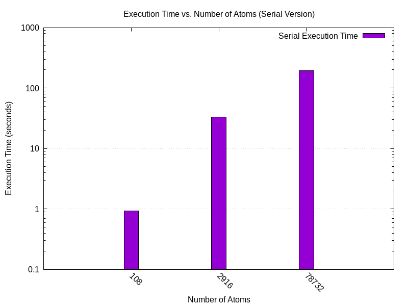
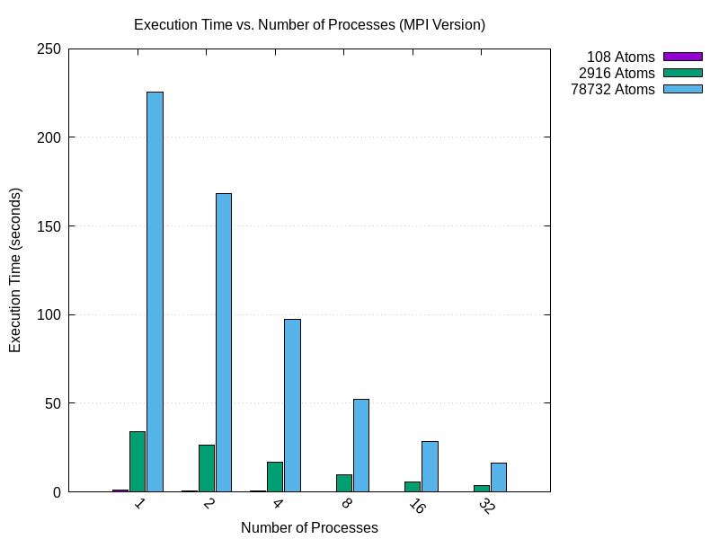
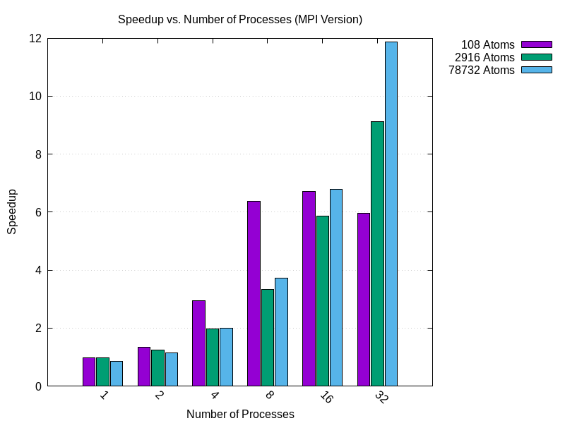
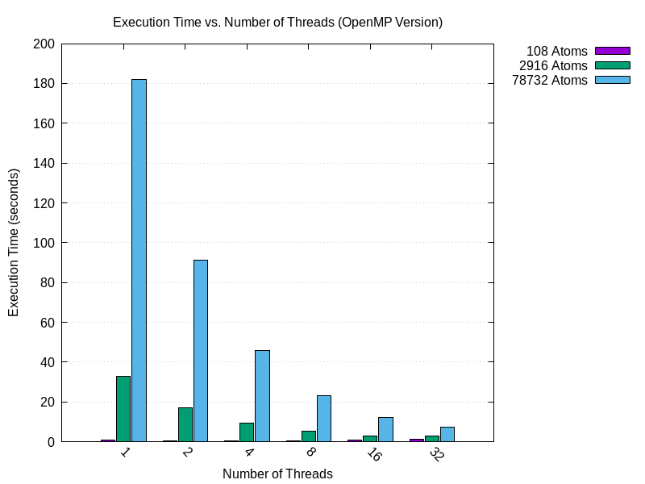
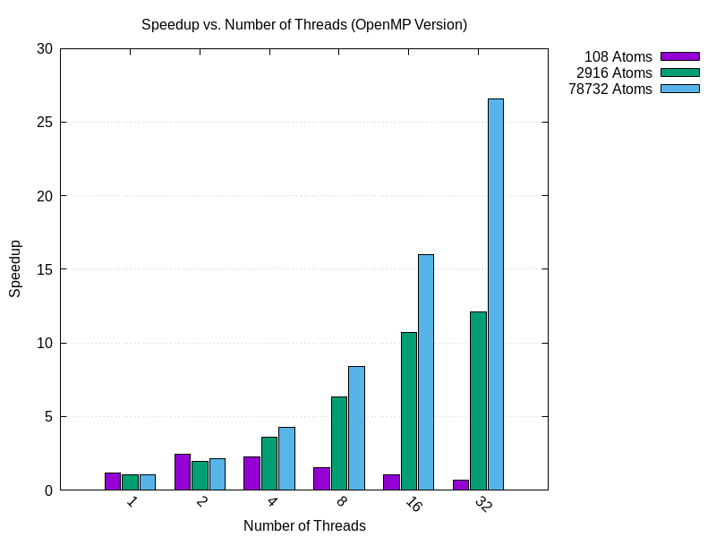
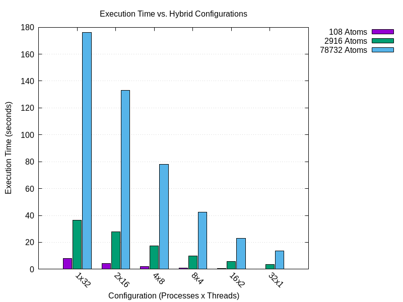
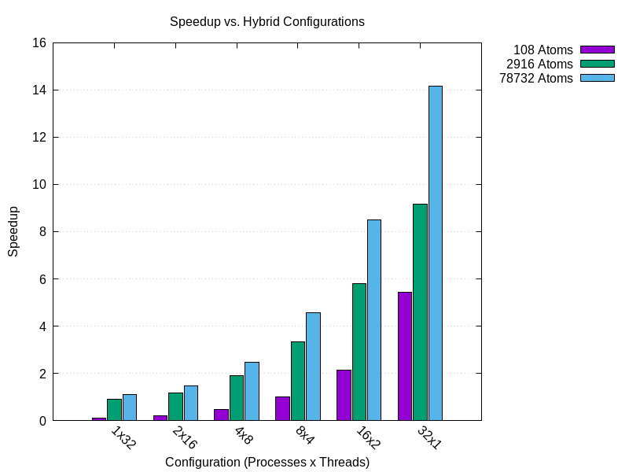
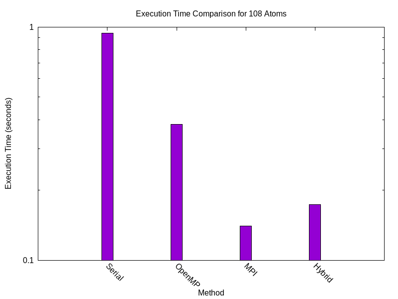
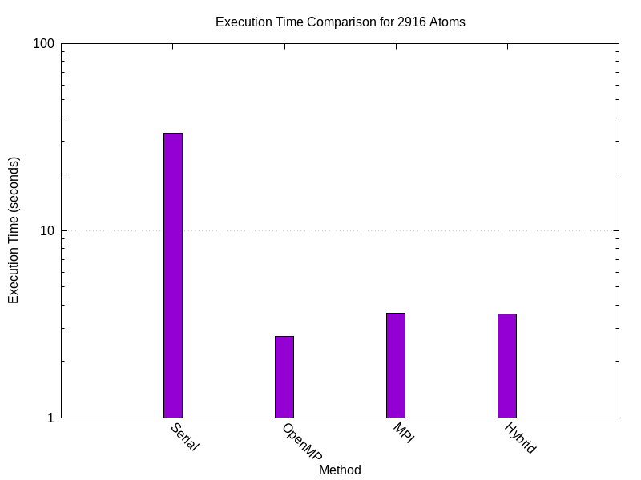
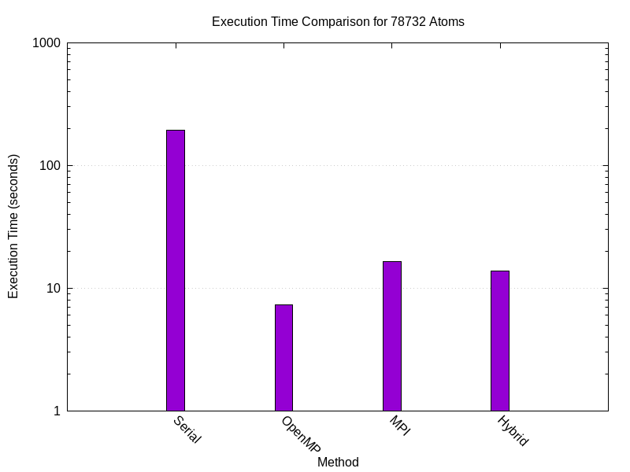

# N-Body Molecular Dynamics Optimization Project Report 

## Authors: 
- Feitosa Benevides André  
- Moreno Triana Jhon Sebastián  
- Redjil Abou Bakr Essadiq  

---

## Introduction 

This project focuses on optimizing and parallelizing a `C` program that simulates molecular dynamics in an $N$-Body classical system. The simulation utilizes the Lennard-Jones potential under periodic boundary conditions, which is mathematically defined as:

$$V(r) = 4 \varepsilon \sum_{i \neq j}^{N} \left[ \left( \frac{\sigma}{r_{ij}} \right)^{12} - \left( \frac{\sigma}{r_{ij}} \right)^{6} \right],$$

where:  

- $r_{ij}$ is the distance between particles $i$ and $j$,  
- $\varepsilon$ represents the depth of the potential well, and  
- $\sigma$ is the characteristic distance at which the potential is zero.  

The system is simulated in a cubic box with periodic boundary conditions, which ensures continuity across the system's edges. 

The project was divided into three subtasks: **optimization**, **parallelization using OpenMP**, and **parallelization using OpenMPI**, followed by a hybrid implementation combining the two parallelization techniques. Team responsibilities were as follows:  

- **Optimization**: Redjil Abou Bakr Essadiq  
- **OpenMP Parallelization**: Feitosa Benevides André  
- **OpenMPI Parallelization**: Moreno Triana Jhon Sebastián  

While individual members led specific subtasks, all team members contributed to the overall project to ensure integration and consistency across tasks. 

---

## Methodology

### Optimization  

The optimization task involved improving the computational efficiency of the original program. The following steps were taken:  

1. **Code Refactoring**: The program was modularized into logically separated files, following the structure detailed in the [`README.md`](https://github.com/Jh0mpis/N-Body-Molecular-Dynamics-MHPC-Project/blob/main/README.md). This enhanced readability, maintainability, and ease of debugging.  
2. **Replacing Expensive Operations**: Costly mathematical functions, such as `pow()` and `sqrt()`, were replaced with efficient alternatives using multiplications and inline arithmetic expressions. For example, instead of calculating $(r)^(-6)$, we computed $r2 = 1.0 / (r * r)$; $r6 = r2inv * r2inv * r2inv$;
3. **Invariant Expression Simplification**: Invariant calculations within loops in the `force()` and `velverlet()` functions were precomputed and stored as constants outside the loops to reduce redundant operations.  
4. **Compiler Optimization**: Optimization flags (e.g., `-O3` for aggressive optimization) were utilized to enable compiler-level performance improvements.  
5. **Newton’s Third Law**: Symmetry in inter-particle forces (Newton’s third law) was exploited in the `force()` function to minimize redundant computations.  

These optimizations collectively reduced the computational overhead and enhanced the overall simulation efficiency.  

### Parallelization Using OpenMP  

The OpenMP implementation introduced shared-memory parallelism to improve performance on multi-core systems. Key steps included:  

1. **Loop Parallelization**: Computationally intensive loops, especially those in the `force()`, but also in `velverlet()` functions, were parallelized using OpenMP directives (`#pragma omp parallel` and `#pragma omp parallel for` appropriate reduction clauses for shared variables, in this case the potential energy.
2. **Critical Section Reduction**: Shared resources were carefully managed to minimize the use of critical sections, which can cause thread contention and slowdowns. We used private copies of the potential energy and for the force we stored the results from each thread in a big array of size `nthreads * natoms`.

This approach leveraged multi-threading to achieve significant speed-ups for simulations on shared-memory systems.  

### Parallelization Using OpenMPI  

The OpenMPI implementation employed message-passing parallelism for distributed-memory architectures. The following techniques were applied:  

1. **Replicated data**: The simulation share the data in all the process using `MPI_Bcast()` function for the particles positions from process 0 to the other process. Then process a smaller region of the same data divided by chunks of data. In the `force()` function each process computes the interaction forces and the potential energy for $\frac{num_particles}{num_process}$ particles and the force produced over the other particles due to interaction, and finally, we recover the original data performing the `MPI_Reduce()` function to process `0`.

### Hybrid Parallelization  

The hybrid approach combined OpenMP and OpenMPI to exploit both shared-and distributed-memory architectures and reduce the communication time performed in the openMPI version. Key steps included:  

1. **Intra-Node Parallelization**: OpenMP was used to parallelize computations within each node.  
2. **Inter-Node Communication**: OpenMPI handled communication between nodes.  
3. **Synchronization**: A careful balance between intra-node and inter-node workloads was maintained to minimize overheads and maximize resource utilization.  

This approach aimed to maximize performance.

---

## Results  

### Serial Performance 

### OpenMPI Performance

### OpenMP Performance

### Hybrid Performance 

To reduce the communication time in openMPI, we implemented the code to support a hybrid model using both openMP and openMPI simultaneously. Then, we compared the time for different process-threads combinations on the Leonardo cluster, considering different number of atoms. 

For the hybrid version, we tested with 1 process and 32 threads, which is the slowest for each particle size. We then gradually decreased the thread number while increasing the number of processes, such that the producs `nthreads * nprocesses = 32`. We tested until different cases until the other extreme: 32 process and 1 thread. The results show that within this constraints the hybrid implementation gets faster as we increase the number of processes and decrease the number of threads.

In terms of speed-up, while perfect scaling was not achieved, the hybrid implementation still increasing in speed-up. For example, we observed a speed-up close to 14 using 32 process and 1 thread. Furthermore, the hybrid version showed better performance as the number of atoms in the simulation increased.

### Methods Comparison 

Finally, we compared each optimization method:

| Implementation    | 108 Timing (s) | 2916 Timing (s) | 78732 Timing (s) | 108 Speedup | 2816 Speedup | 78732 Speedup  |
|-------------------|--------|---------|----------|--------|---------|---------|
| Optimized (Seq.)  | 0.8758 | 33.3646 | 193.0099 | 1.0000 | 1.0000  | 1.0000  |
| OpenMP            | 0.3830 | 2.7248  | 7.3134   | 2.2867 | 12.2448 | 26.3913 |
| OpenMPI           | 0.1399 | 3.6102  | 16.3669  | 6.2602 | 9.2417  | 11.7927 |
| Hybrid            | 0.1729 | 3.5955  | 13.7019  | 5.0653 | 9.2795  | 14.0864 |

We selected the best time for each method and calculated the corresponding speed-up for each simulation. Overall, the openMP performed best for simulations with a large number of particles, while OpenMPI showed better scaling for smaller particle systems.

**Simulation with 108 Particles**

For the simulation system with 108 atoms, the openMPI implementation was the fastest,  achieving a speed-up of approximately 6.2. The OpenMP is the slowest, with a speed-up of around 2.28. The hybrid version performed comparably to openMPI, with a speed-up of 5.1.

**Simulation with 2916 Particles**

For the simulation with 2916 particles, openMP was the fastest, achieving a speed-up up to 12.24. The openMPI and hybrid implementations performed similarly, with speed-ups of between 9.24 and 2.27, respectively.

**Simulation with 78732 Particles**

For largest data set, with 78732 atoms, the openMP implementation scaled the best, achieving a speed-up of 26.39. In contrast, the openMPI implementation was the slowest, with a speed-up of 11.79 using 32 process. The hybrid implementation fell in between, with a speed-up of 14.08.

## Discussion  

The optimization and parallelization efforts yielded significant performance improvements across all simulation sizes. This section provides a critical analysis of where improvements were observed and explores the underlying reasons.

### Optimization Improvements

The optimized serial version served as a crucial baseline for evaluating parallel performance. Key improvements included:

    Elimination of Expensive Operations: Replacing functions like pow() and sqrt() with arithmetic operations significantly reduced computational overhead. These functions are computationally intensive, and their elimination led to measurable time savings.

    Exploiting Symmetry: Implementing Newton's third law in the force calculations halved the number of pairwise force computations. Instead of computing forces twice for each pair (once for each particle), we computed it once and applied equal and opposite forces, effectively reducing the computational complexity from $\mathcal{O}(N^2)$ to $\mathcal{O}(N(N-1)/2)$.

    Loop Invariant Code Motion: Moving calculations that do not change within loops (loop invariants) outside of the loops reduced redundant computations, further enhancing performance.

### Impact of Cache Utilization

An important factor influencing performance is how well the data fits into the CPU caches, particularly the L1 cache:

- Small Problem Sizes and Cache Efficiency: For simulations with a small number of particles (e.g., 108 particles), the arrays and data structures used in the simulation are small enough to fit entirely within the L1 cache. This results in faster data access times, as the CPU can retrieve data from the cache rather than slower main memory. This high cache hit rate contributes to better performance in the serial and OpenMPI implementations for small problem sizes.

- Large Problem Sizes and Cache Misses: As the number of particles increases (e.g., 78,732 particles), the data structures exceed the size of the L1 cache (typically around 32KB to 64KB per core). Consequently, cache misses become more frequent, and the CPU must fetch data from the slower L2 cache, L3 cache, or main memory. This increased memory access latency can degrade performance, especially in memory-intensive applications like molecular dynamics simulations.

### OpenMP Parallelization

OpenMP introduced shared-memory parallelism, yielding substantial speed-ups, particularly for larger simulations:

    Scalability with System Size: The speed-up increased with the number of particles, reaching up to 26.55 for 78,732 particles. Larger systems offer more computational work per thread, which improves the computation-to-overhead ratio and leads to better utilization of CPU cores.

    Thread Overhead in Small Systems: For the 108-particle simulation, the speed-up was only 2.45. The overhead of spawning threads and synchronization outweighed the benefits due to the limited computational workload per thread.

    Memory Bandwidth Limitations: As the number of threads increased, memory bandwidth became a bottleneck. With more threads accessing shared memory, contention increased, slightly diminishing returns when scaling to a high number of threads.

### OpenMPI Parallelization

MPI leveraged distributed-memory parallelism, with performance varying based on system size:

- Efficiency in Small Systems: OpenMPI achieved the highest speed-up (6.72) for the 108-particle simulation. The distribution of particles across processes reduced the per-process computational load, and the relatively small amount of data minimized communication overhead.

- Communication Overhead in Large Systems: As the number of particles increased, the amount of data that needed to be communicated between processes grew significantly. For the 78,732-particle simulation, the speed-up was 11.86, less than half of OpenMP's speed-up. The increased communication time due to exchanging large data volumes over the network offset some of the benefits of parallel computation.

- Latency vs. Throughput: MPI's performance is sensitive to network latency and bandwidth. While it can handle large data transfers, the latency associated with initiating communications can become significant, especially when frequent synchronization is required.

### Hybrid Parallelization

The hybrid implementation aimed to combine the strengths of both OpenMP and MPI:

- Balanced Workload: By using multiple processes with multiple threads, we attempted to optimize both intra-node and inter-node parallelism. This approach mitigated some of the communication overhead seen in the pure MPI implementation by reducing the number of processes and increasing the computation per process through threading.

- Optimal Configuration: Our tests indicated that the configuration with 32 processes and 1 thread per process offered the best performance. This setup minimized the communication overhead by reducing the number of threads contending for shared memory within a node and leveraging more processes to distribute the workload.

- Complexity and Overhead: Despite the improved performance, the hybrid model introduced additional complexity in managing both threading and inter-process communication. Synchronization between threads and processes added overhead, and achieving efficient load balancing was more challenging.

### Critical Analysis of Performance Improvements

- Cache Hierarchy Impact: The performance differences observed across simulations of varying sizes highlight the importance of cache hierarchy in high-performance computing. Small datasets that fit within the L1 cache benefit from faster data access, leading to better performance in both serial and MPI implementations for small problem sizes.

- Computational Intensity: The performance gains were more pronounced in simulations with higher computational intensity (i.e., larger particle counts). This is because the overhead associated with parallelization (thread/process management, synchronization, communication) is amortized over a larger amount of computation.

- Computational Intensity vs. Memory Access: In larger simulations, the computational intensity increases, but so does the volume of data that must be accessed from slower memory levels. OpenMP's shared-memory model benefits from faster intra-node memory access compared to inter-node communication in MPI, which is why OpenMP outperforms MPI in large simulations despite potential cache misses.

- Communication vs. Computation Trade-off: OpenMP excelled in minimizing communication overhead due to shared memory, making it ideal for compute-bound applications. In contrast, MPI's performance was hindered in large systems by communication costs, which became a significant portion of the total execution time.

- Load Balancing: Ensuring even distribution of particles and workload was crucial. Imbalances led to some processes or threads finishing earlier and waiting for others, reducing overall efficiency. Our implementations attempted to distribute particles evenly, but inherent data dependencies and interaction patterns sometimes caused uneven workloads.

- Scalability Limits: OpenMP scalability was limited by the number of available cores and memory bandwidth. Beyond a certain number of threads, adding more did not result in significant speed-ups. MPI scalability was limited by network performance and the efficiency of communication patterns.

### Why Certain Methods Performed Better

- OpenMP's Advantage in Large Systems: For large simulations, the computational workload per thread was substantial, allowing OpenMP to utilize all CPU cores effectively without significant overhead from thread management or memory contention.

- MPI's Strength in Small Systems: MPI was able to distribute the small computational workload efficiently across processes with minimal communication overhead, outperforming OpenMP in the smallest simulation.

- Hybrid Model's Middle Ground: The hybrid approach balanced the computational workload and communication needs, performing consistently across different system sizes but not necessarily outperforming the best specialized method in each case.

---

## Conclusion  

This project successfully optimized and parallelized the molecular dynamics simulation using a combination of OpenMP, OpenMPI, and hybrid techniques. The key findings are:

- Optimization Effectiveness: Code optimization can be a significant headstart for reducing execution times by eliminating algorithmic efficiencies.

- OpenMP's Strength in Large-Scale Simulations: OpenMP achieved the highest speed-ups in large simulations due to efficient multi-threading and low communication overhead in shared-memory architectures.

- OpenMPI's Suitability for Smaller Systems: OpenMPI performed best in small-scale simulations where communication overhead was minimal, effectively distributing the workload across processes.

- Hybrid Approach as a Compromise: The hybrid method provided balanced performance across different system sizes, combining intra-node threading with inter-node processing, though it introduced additional complexity.

### Implications

Our results seem to indicate a particular way of selecting the appropriate parallelization strategy based on the problem size and computational resources:

- Large Simulations: Utilize OpenMP to maximize core utilization with minimal communication overhead.

- Small Simulations: Leverage MPI to distribute computations efficiently without significant communication costs.

- Variable Workloads: Consider a hybrid approach when the computational workload and system architecture can benefit from both threading and distributed processing.

---
